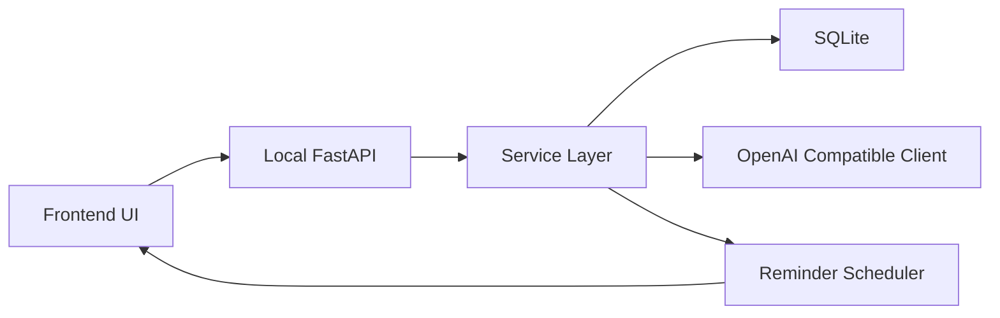

# StepStarter 完整软件规划（Python 桌面 + HTML 前端 UI + OpenAI Compatible API）

> 目标读者：编程新手（但希望做出可发布的 Windows 桌面软件）。
>
> 核心原则：**先做最小可用版本（MVP）** → 再逐步加功能；优先稳定、可维护、可打包。
>
> 本版已纳入你指定的增强功能：
> - 温和提醒 + 进度核实
> - 未完成任务的次日启动建议
> - 计时器（开始/暂停/结束）
> - 日历/时间线记录
> - 周报/月报/年报（音乐软件风格）
> - 设置界面：自定义 Base URL + API Key（OpenAI Compatible API）

---

## 第一部分：产品分析与平台建议

### 1. 分析这个产品创意的可行性

**结论：可行，并且差异化明确。**

- **用户痛点真实**：拖延症用户最缺的不是“计划”，而是“启动动作”。把目标拆成极小步骤（micro-steps）能显著降低心理阻力。
- **AI适配度高**：AI擅长把模糊输入转成结构化步骤；还能根据用户状态（在床上、没动力、焦虑）生成更温和的引导。
- **桌面端合理**：桌面端更适合“提醒 + 记录 + 复盘”，也更适合做常驻托盘、开机自启、离线数据存储。

**主要风险与应对**

1) **AI输出不稳定**（步骤太大、太空泛、或不安全）
- 应对：
  - 设计严格的提示词与输出 JSON schema
  - 做“步骤质量检查器”（自动把过大步骤拆小、或要求 AI 重写）
  - 提供“用户一键缩小步骤”按钮（把某一步再拆成 3-5 个更小动作）

2) **提醒/核实会打扰用户**（反而增加压力）
- 应对：
  - 默认“温和提醒”：不带责备文案
  - 提供“稍后再说 / 延后10分钟 / 今天跳过”
  - 提醒频率可控（MVP 只做单次提醒）

3) **记录负担过重**（拖延症用户不爱填表）
- 应对：
  - 核实弹窗只问 1-2 个问题：完成了吗？进度百分比？
  - 进度用快捷按钮（0/25/50/75/100）
  - 耗时尽量自动记录（计时器）

4) **功能膨胀**（日历、报表、建议引擎…容易变复杂项目）
- 应对：
  - 明确“行动启动”是核心
  - 其他功能全部围绕“让用户更容易开始下一次行动”服务
  - 用里程碑拆分：MVP → 提醒/计时 → 日历 → 报表

---

### 1) 如果是新手开发者，推荐最现实的开发路径

**推荐路径：PyWebView + 本地 FastAPI + SQLite**

原因：
- PyWebView 让你用 HTML/CSS/JS 做现代 UI，同时仍是桌面应用。
- Python 负责核心逻辑、数据、AI 调用。
- SQLite 适合本地存储（无需安装数据库）。
- 打包到 exe 相对成熟（PyInstaller）。

**最现实的 MVP（一个核心闭环）**

- 输入：用户一句话描述当前状态/目标
- 输出：AI 生成 5-12 个“非常小”的步骤
- 执行：用户勾选步骤（或点“下一步”）
- 记录：完成/进度/耗时（尽量少填）

MVP 不做：复杂报表、年报、跨设备同步、多账号系统。

---

### 2) 建议可以增加哪些功能，让软件更有价值（你已选定）

按“对拖延症用户价值”排序：

1. **一键缩小步骤**（最关键）
- 任何一步都可以点“再拆小一点”，AI 生成更细步骤。

2. **温和提醒 + 进度核实**
- 用户设置 X 分钟后提醒：
  - 弹窗问：完成了吗？进度多少？
  - 如果未完成：建议下一步最小动作

3. **未完成任务的次日启动建议**
- 第二天打开软件：
  - 显示“昨天未完成的任务”
  - 给出“今天最容易开始的第一步”

4. **计时器（开始/暂停/结束）**
- 不强迫用户填耗时，尽量自动记录。

5. **日历/时间线记录**
- 以“完成的任务 + 耗时 + 进度”形成可视化。

6. **周报/月报/年报（音乐软件风格）**
- 用“启动次数、完成率、最常见阻力、最有效的启动步骤”呈现。

7. **设置界面：自定义 API（Base URL + Key）**
- 让用户可接入任意 OpenAI Compatible API（含自建/第三方）。

---

## 第二部分：需求理解

### 1. 总结软件核心目标

- 让用户在“想做但做不动”的状态下，**快速迈出第一步**。
- 通过 AI 把目标拆成**极小、具体、可执行**的步骤，降低启动阻力。
- 通过提醒、计时、记录、复盘，让用户更容易持续启动下一次行动。

### 2. 判断复杂度（简单 / 中等 / 复杂）

**整体复杂度：复杂。**

原因：
- 你要做的不只是“生成步骤”，还包含：提醒调度、计时会话、日历视图、周期报表、次日建议、设置系统。
- 但可以通过“分阶段交付”把复杂度拆开，让新手也能稳步实现。

### 3. 推荐技术方案

**推荐方案（新手友好、稳定优先）：**

- UI：HTML/CSS/JS（单页应用即可，不强制上 React/Vue）
- 桌面容器：PyWebView
- 后端：Python + FastAPI（本地接口）
- 数据：SQLite（建议 SQLAlchemy；也可 sqlite3 但后期维护更难）
- AI：OpenAI Compatible API（HTTP 调用，支持自定义 Base URL）
- 打包：PyInstaller（Windows exe）

**为什么不优先 Electron？**
- Electron 生态强，但对新手来说 Node + 打包 + 体积 + Python 交互会更复杂。

---

## 第三部分：模块拆分（非常重要，已按新增功能重构）

下面按“新手能理解”的方式拆模块，并标注优先级（P0/P1/P2/P3）。

### 模块 0：启动入口与生命周期模块（P0）

**作用**
- 程序启动
- 初始化配置、数据库
- 启动本地 API 服务
- 打开 PyWebView 窗口
- 退出时安全关闭（保存状态、停止计时器、停止定时任务）

**与其他模块通信**
- 调用配置模块读取设置
- 调用数据模块初始化数据库
- 启动 API 模块
- 启动提醒调度模块

---

### 模块 1：UI 界面模块（P0）

**作用**
- 提供现代简洁 UI（输入、步骤、勾选、下一步）
- 提供计时器 UI（开始/暂停/结束）
- 提供提醒弹窗 UI（进度核实）
- 提供日历/时间线 UI
- 提供报表 UI（周/月/年）
- 提供设置 UI（Base URL + API Key）

**建议页面结构（单页多视图）**
- Home：输入目标 → 生成步骤
- Task：步骤列表 + 下一步 + 再拆小一点 + 计时器
- Check-in：提醒弹窗（完成/进度/备注）
- Calendar：日历/时间线
- Reports：周报/月报/年报
- Settings：API 配置

**与其他模块通信**
- 通过本地 API 调用后端（JSON）

---

### 模块 2：本地 API 通信模块（P0）

**作用**
- 定义前后端交互接口
- 统一请求/响应格式、错误码

**建议 API（MVP + 你要的功能）**
- 健康检查：`GET /health`
- AI：
  - `POST /ai/steps` 生成步骤
  - `POST /ai/refine-step` 把某一步再拆小
- 任务：
  - `POST /tasks` 创建任务
  - `GET /tasks/today` 今日任务
  - `GET /tasks/pending` 未完成任务
  - `PATCH /tasks/{id}` 更新任务状态/进度
- 步骤：
  - `PATCH /steps/{id}` 勾选/取消
- 计时：
  - `POST /timer/start`
  - `POST /timer/pause`
  - `POST /timer/stop`
  - `GET /timer/status`
- 提醒/核实：
  - `POST /reminders` 创建单次提醒
  - `POST /checkins` 写入核实记录
- 日历/统计：
  - `GET /calendar/day?date=YYYY-MM-DD`
  - `GET /stats/weekly?week=YYYY-WW`
  - `GET /stats/monthly?month=YYYY-MM`
  - `GET /stats/yearly?year=YYYY`
- 建议：
  - `GET /suggestions/next-start` 次日/今日启动建议
- 设置：
  - `GET /settings`
  - `PATCH /settings` 更新 Base URL / API Key

**与其他模块通信**
- API 层只做“路由 + 参数校验 + 调用服务层”，不写业务细节。

---

### 模块 3：AI 交互模块（OpenAI Compatible Client）（P0）

**作用**
- 通过用户设置的 Base URL + API Key 调用 OpenAI Compatible API
- 支持模型名配置（可先写死默认，后续再开放）
- 统一超时、重试、错误处理

**关键点（新手容易踩坑）**
- Base URL 可能是：
  - `https://api.openai.com/v1`
  - 或第三方/自建：`http://127.0.0.1:8000/v1`
- 需要在设置里保存：
  - base_url
  - api_key
  - model（可选）

---

### 模块 4：步骤生成与质量控制模块（P0）

**作用**
- 把用户输入转成“极小步骤”
- 做输出校验：
  - 步骤数量范围（例如 5-12）
  - 每步是否具体（避免“开始学习”这种空话）
  - 每步是否单动作（避免一条里多个动作）
- 支持“再拆小一点”

**输出格式（强制 JSON）**
- `title`: string
- `steps`: string[]
- `tags`: string[]（可选：学习/家务/工作/烹饪）
- `safety_notes`: string[]（可选）

---

### 模块 5：任务与步骤管理模块（P1）

**作用**
- 任务状态机：
  - draft（刚生成）
  - active（进行中）
  - paused（暂停）
  - done（完成）
  - abandoned（放弃/归档）
- 步骤勾选逻辑
- “下一步”推荐（从未完成步骤中选最小的一步）

---

### 模块 6：计时器与会话记录模块（P1）

**作用**
- 支持开始/暂停/结束
- 记录每次专注会话（session）
- 允许一个任务多次 session

**数据建议**
- session 记录：task_id、start_time、end_time、paused_total、duration

**与提醒模块关系**
- 提醒弹窗出现时，不强制停止计时；但可提示用户选择。

---

### 模块 7：温和提醒 + 进度核实模块（P1）

**作用**
- 用户为某个任务设置“X 分钟后提醒”
- 到点弹窗核实：
  - 完成了吗？
  - 进度百分比（0-100）
  - 可选备注（遇到的阻力）

**温和提醒文案原则**
- 不评判、不指责
- 提供选项：
  - 已完成
  - 还在进行（填进度）
  - 延后 10 分钟
  - 今天先到这里

---

### 模块 8：次日启动建议模块（P2）

**作用**
- 每次启动软件时：
  - 扫描未完成任务（progress < 100 或状态非 done）
  - 生成“今天最容易开始的第一步”建议

**建议生成策略（先简单后智能）**
- 规则版（先做）：
  - 优先选择“最近更新的未完成任务”
  - 推荐其“第一个未完成步骤”
- AI 增强（后做）：
  - 根据用户昨日备注/阻力，生成更温和的建议语

---

### 模块 9：日历/时间线记录模块（P2）

**作用**
- 以天为单位展示：
  - 做了哪些任务
  - 每个任务耗时（来自 session）
  - 进度变化（来自 check-in）

**展示建议（新手可实现）**
- 先做“时间线列表”：按日期分组
- 再做“月历格子”：点击某天展开详情

---

### 模块 10：周报/月报/年报模块（音乐软件风格）（P3）

**作用**
- 生成周期总结卡片（可分享）

**建议指标（围绕行动启动）**
- 启动次数（开始计时/开始任务的次数）
- 完成率（完成任务数 / 创建任务数）
- 平均启动耗时（从创建到第一次开始计时的时间差，可选）
- 最常见阻力关键词（来自备注）
- 最有效的启动步骤类型（例如：收拾桌面/打开文件/准备材料）

**呈现风格**
- 大标题 + 关键数字 + 2-3 个洞察句
- 类似音乐软件的“年度听歌报告”

---

### 模块 11：设置与配置模块（P1）

**作用**
- 保存用户设置：
  - OpenAI Compatible API：base_url、api_key、model（可选）
  - 默认提醒时长（可选）
  - UI 偏好（可选）

**安全建议**
- API Key 本地保存：
  - MVP：明文存本地（提示用户风险）
  - 后续：使用 Windows Credential Manager（进阶）

---

### 模块 12：数据管理模块（SQLite）（P0-P1）

**作用**
- 本地持久化：任务、步骤、计时会话、提醒、核实记录、设置

**建议数据表（覆盖你要的功能）**
- `settings`
  - id, base_url, api_key, model, created_at, updated_at
- `tasks`
  - id, title, user_input, status, progress, created_at, updated_at, completed_at
- `steps`
  - id, task_id, idx, content, done, created_at, updated_at
- `sessions`
  - id, task_id, start_time, end_time, paused_total_seconds
- `reminders`
  - id, task_id, fire_at, status(pending/fired/canceled), created_at
- `checkins`
  - id, task_id, reminder_id(nullable), progress, note, created_at

---

### 模块之间如何通信（总览）



说明：
- UI 只通过 API 与后端交互
- Service Layer 统一调度 AI、DB、提醒、建议、统计

---

### 开发优先顺序（建议）

- **P0（必须先做，跑通闭环）**
  1) 启动入口与生命周期
  2) UI（Home + Task）
  3) 本地 API
  4) OpenAI Compatible Client
  5) 步骤生成与质量控制
  6) 数据管理（tasks/steps/settings）

- **P1（你指定的核心增强）**
  7) 计时器与 sessions
  8) 温和提醒 + 进度核实（reminders/checkins）
  9) 设置界面（base_url/key）

- **P2（体验增强）**
  10) 次日启动建议
  11) 日历/时间线

- **P3（高级呈现）**
  12) 周报/月报/年报

---

## 第四部分：项目目录结构设计（已纳入设置/提醒/报表）

建议目录树（适合新手、清晰分层）：

```text
StepStarter/
├─ backend/
│  ├─ app/
│  │  ├─ api/
│  │  │  ├─ routes_ai.py
│  │  │  ├─ routes_tasks.py
│  │  │  ├─ routes_timer.py
│  │  │  ├─ routes_reminders.py
│  │  │  ├─ routes_calendar.py
│  │  │  ├─ routes_reports.py
│  │  │  └─ routes_settings.py
│  │  ├─ core/
│  │  │  ├─ config.py
│  │  │  ├─ paths.py
│  │  │  ├─ logging.py
│  │  │  └─ constants.py
│  │  ├─ services/
│  │  │  ├─ llm_client.py
│  │  │  ├─ step_generator.py
│  │  │  ├─ task_service.py
│  │  │  ├─ timer_service.py
│  │  │  ├─ reminder_service.py
│  │  │  ├─ suggestion_service.py
│  │  │  ├─ calendar_service.py
│  │  │  └─ report_service.py
│  │  ├─ data/
│  │  │  ├─ db.py
│  │  │  ├─ models.py
│  │  │  └─ repo.py
│  │  └─ main_api.py
│  └─ tests/
├─ frontend/
│  ├─ index.html
│  ├─ styles/
│  │  └─ main.css
│  ├─ scripts/
│  │  ├─ api.js
│  │  ├─ router.js
│  │  ├─ views_home.js
│  │  ├─ views_task.js
│  │  ├─ views_calendar.js
│  │  ├─ views_reports.js
│  │  ├─ views_settings.js
│  │  └─ components.js
│  └─ assets/
│     └─ icons/
├─ desktop/
│  ├─ main_desktop.py
│  ├─ window.py
│  └─ tray.py
├─ assets/
│  ├─ app_icon.ico
│  └─ fonts/
├─ config/
│  └─ default.yaml
├─ plans/
│  └─ entire_project_develop.md
├─ requirements.txt
├─ README.md
└─ build/
   └─ pyinstaller.spec
```

目录用途解释：
- `backend/`：Python 后端（API、AI、数据、提醒、计时、统计、报表）
- `frontend/`：HTML/CSS/JS 前端资源（PyWebView 加载这里）
- `desktop/`：桌面容器层（创建窗口、托盘、与后端一起启动）
- `assets/`：应用图标、字体等通用资源
- `config/`：默认配置（不放密钥）
- `build/`：打包配置（PyInstaller spec）

---

## 第五部分：开发步骤路线图（新手友好，覆盖你要的功能）

### Step 1：创建基础环境

**目标**
- 建立 Python 虚拟环境
- 安装依赖（pywebview、fastapi、uvicorn、httpx、sqlalchemy 等）

**成功标志**
- 能运行一个 Python 脚本并弹出空窗口（或能启动 FastAPI）

**新手可能遇到的问题**
- Python 版本不一致
- pip 安装失败（网络/权限）
- Windows 路径问题

---

### Step 2：搭建最小 UI（静态页面）

**目标**
- 做一个现代简洁页面：输入框 + 生成按钮 + 步骤列表区域

**成功标志**
- 打开 `index.html` 能看到 UI

**新手可能遇到的问题**
- CSS 布局不熟（建议用 Flexbox）
- 字体与间距不好看（先用简单设计系统）

---

### Step 3：建立 Python 本地接口（API）

**目标**
- FastAPI 提供 `GET /health`

**成功标志**
- 访问 `http://127.0.0.1:xxxx/health` 返回 ok

**新手可能遇到的问题**
- 端口被占用
- CORS（如果用浏览器调试前端）

---

### Step 4：打通前后端通信（先用假数据）

**目标**
- 前端点击按钮 → 调用 `POST /ai/steps`（先返回假数据）→ 渲染步骤列表

**成功标志**
- UI 能显示后端返回的步骤

**新手可能遇到的问题**
- fetch 请求格式错误
- JSON 解析错误

---

### Step 5：加入设置界面（Base URL + API Key）

**目标**
- UI 增加 Settings 页面
- 后端提供 `GET/PATCH /settings`
- 设置保存到 SQLite

**成功标志**
- 用户能保存 base_url 与 api_key
- 重启软件设置仍存在

**新手可能遇到的问题**
- 不知道把数据库放哪（建议 AppData）
- API Key 安全（MVP 先明文存，提示风险）

---

### Step 6：集成 AI（OpenAI Compatible API）

**目标**
- 后端读取设置中的 base_url/key
- 调用 LLM 生成结构化步骤

**成功标志**
- 输入一句话 → 得到 5-12 个可执行步骤

**新手可能遇到的问题**
- Base URL 拼接错误（是否包含 `/v1`）
- 返回格式差异（不同兼容实现可能略不同）
- 超时/限流

---

### Step 7：加入任务保存（SQLite）

**目标**
- 保存任务与步骤
- 支持历史任务列表

**成功标志**
- 关闭软件再打开，历史任务仍在

**新手可能遇到的问题**
- 表结构变更（建议先固定 MVP 表结构）

---

### Step 8：加入计时器（开始/暂停/结束）

**目标**
- Task 页面增加计时器按钮
- 后端记录 sessions

**成功标志**
- 能开始计时、暂停、结束
- session 写入数据库

**新手可能遇到的问题**
- 暂停时长计算
- 应用关闭时的状态恢复（先做“关闭即停止”也可以）

---

### Step 9：加入温和提醒 + 进度核实

**目标**
- 用户设置 X 分钟后提醒
- 到点弹窗核实进度（百分比 + 备注）

**成功标志**
- 到点弹窗出现
- 填写后写入 checkins
- 任务 progress 更新

**新手可能遇到的问题**
- 定时器与 UI 线程冲突
- 弹窗交互复杂（先做简单弹窗）

---

### Step 10：加入次日启动建议

**目标**
- 启动时扫描未完成任务
- 给出“今天从哪个任务开始 + 下一步”

**成功标志**
- 打开软件能看到建议卡片

**新手可能遇到的问题**
- 建议规则不合理（先做简单规则，后续再优化）

---

### Step 11：加入日历/时间线记录

**目标**
- Calendar 页面展示每日任务与耗时

**成功标志**
- 能按天查看任务、session 总时长、进度变化

**新手可能遇到的问题**
- 日期处理（时区/跨天）
- UI 组件（先用列表，再做月历）

---

### Step 12：加入周报/月报/年报（音乐软件风格）

**目标**
- Reports 页面生成周期总结

**成功标志**
- 能生成周报/月报/年报卡片

**新手可能遇到的问题**
- 统计口径不一致
- 图表库选择（先用纯 HTML 卡片 + 简单条形图）

---

## 第六部分：AI 生成代码策略（非常重要，适配本项目）

### 1) 每个阶段应该让 AI 生成哪些文件

- 阶段 A（UI MVP）：
  - `frontend/index.html`
  - `frontend/styles/main.css`
  - `frontend/scripts/api.js`
  - `frontend/scripts/views_home.js`

- 阶段 B（API 骨架）：
  - `backend/app/main_api.py`
  - `backend/app/api/routes_ai.py`
  - `backend/app/api/routes_settings.py`

- 阶段 C（LLM 客户端 + 步骤生成）：
  - `backend/app/services/llm_client.py`
  - `backend/app/services/step_generator.py`

- 阶段 D（数据层）：
  - `backend/app/data/db.py`
  - `backend/app/data/models.py`

- 阶段 E（计时 + 提醒 + 核实）：
  - `backend/app/services/timer_service.py`
  - `backend/app/services/reminder_service.py`
  - `backend/app/api/routes_timer.py`
  - `backend/app/api/routes_reminders.py`

- 阶段 F（日历 + 报表 + 建议）：
  - `backend/app/services/calendar_service.py`
  - `backend/app/services/report_service.py`
  - `backend/app/services/suggestion_service.py`
  - `frontend/scripts/views_calendar.js`
  - `frontend/scripts/views_reports.js`

- 阶段 G（桌面容器 + 打包）：
  - `desktop/main_desktop.py`
  - `desktop/window.py`
  - `build/pyinstaller.spec`

---

### 2) 一次生成多少代码最安全

- **一次只生成 1-3 个文件**最安全。
- 每个文件只做一个职责：
  - 例如 `llm_client.py` 只负责 HTTP 调用，不要混入数据库。

---

### 3) 如何避免 AI 生成过长代码导致错误

- 让 AI 先输出：
  1) 文件列表
  2) 每个文件职责
  3) 接口定义（路由/函数签名）

你确认后再生成具体代码。

- 强制 AI 输出“最小可运行版本”，不要一次做完所有功能。

- 对 AI 的要求要具体：
  - 输入/输出 JSON 示例
  - 错误处理策略（重试、超时）
  - 日志打印位置

---

### 4) 如何调试 AI 生成的项目

- 后端：
  - 先单独跑 FastAPI（看 `/docs`）
  - 用 Postman 测接口

- 前端：
  - 先在浏览器打开静态页面调 UI
  - 再接入 API

- 桌面：
  - 最后再用 PyWebView 包起来

- 常见调试技巧：
  - 每个 API 返回都带 `request_id`
  - 关键路径加日志
  - AI 原始输出保存到本地（便于复现问题）

---

## 第七部分：打包方案（Windows exe）

### 推荐工具

- **PyInstaller**：最常见、资料多、适合新手

### 打包建议流程

1. 先确认：
- Python 后端可运行
- 前端资源路径固定
- 数据库路径可写（建议放到用户目录 AppData）

2. PyInstaller 打包：
- 入口一般是 `desktop/main_desktop.py`
- 把 `frontend/`、`assets/`、`config/` 作为数据文件打包进去

3. 处理常见问题
- **资源路径**：打包后相对路径会变，需要统一用“运行时资源路径函数”
- **杀毒误报**：尽量减少动态下载行为；签名可降低误报（后期）
- **体积**：PyWebView + Python 会有一定体积，属于正常

### 发布形态建议

- 初期：文件夹版（更稳定）
- 后期：安装包（Inno Setup / NSIS）

---

## 附：MVP 的关键交互（建议你坚持的产品核心）

- 输入框：用户描述当前状态/目标
- 生成按钮：AI 输出步骤
- 步骤列表：每步可勾选
- “下一步”按钮：只强调下一步，不展示太多压力
- “再拆小一点”按钮：对任何一步都可用
- 计时器：开始/暂停/结束
- 温和提醒：到点核实进度

---

## 附：UI 风格建议（现代、简洁、低压力）

- 色彩：低饱和、柔和背景（浅灰/米白）+ 单一强调色（蓝/绿）
- 字体：系统字体优先（Windows Segoe UI）
- 组件：大按钮、圆角、留白
- 文案：温和、非评判（例如：不是“你又没完成”，而是“我们从最小一步开始”）

---

## 附：报表文案示例（音乐软件风格）

- 周报标题：本周你完成了 **7 次启动**
- 洞察句：
  - 你最常启动的类型：学习
  - 你最有效的第一步：打开文件/准备材料
  - 你最常遇到的阻力：困、分心

---

## 下一步（执行层面建议）

- 先把 P0 做出来：
  - UI Home/Task
  - FastAPI health + 假 steps
  - Settings（base_url/key）
  - LLM client 跑通
  - SQLite 保存 tasks/steps/settings

做到这一步，你就拥有一个可运行的“桌面壳 + UI + API + AI + 数据”骨架，后续再逐步加计时、提醒、日历、报表。
