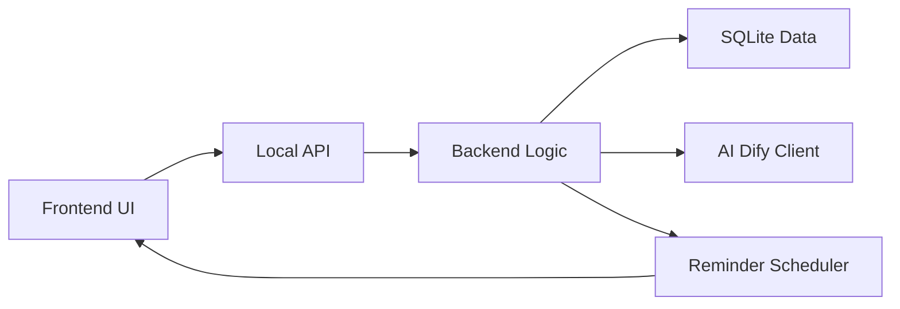

# StepStarter 完整软件规划（Python 桌面 + HTML 前端 UI + Dify AI）

> 目标读者：编程新手（但希望做出可发布的 Windows 桌面软件）。
> 
> 核心原则：**先做最小可用版本（MVP）** → 再逐步加功能；优先稳定、可维护、可打包。

---

## 第一部分：产品分析与平台建议

### 1. 分析这个产品创意的可行性

**结论：可行，并且有明确差异化。**

- **用户痛点真实**：拖延症用户最缺的不是“计划”，而是“启动动作”。把目标拆成极小步骤（micro-steps）能显著降低心理阻力。
- **AI适配度高**：AI擅长把模糊输入转成结构化步骤；同时可以根据用户状态（在床上、没动力、焦虑）生成更温和的引导。
- **桌面端合理**：桌面端更适合“提醒 + 记录 + 复盘”，也更适合做常驻托盘、开机自启、离线数据存储。

**主要风险与应对**

1) **AI输出不稳定**（步骤太大、太空泛、或不安全）
- 应对：
  - 设计严格的提示词与输出 JSON schema
  - 做“步骤质量检查器”（自动把过大步骤拆小、或要求 AI 重写）
  - 提供“用户一键缩小步骤”按钮（例如：把第3步再拆成 3-5 个更小动作）

2) **用户坚持记录困难**（拖延症用户不爱填表）
- 应对：
  - 记录流程极简：只问 1-2 个问题（完成了吗？进度百分比？耗时？）
  - 默认值与快捷按钮（0/25/50/75/100）
  - 自动从系统时间推断耗时（开始/暂停/结束计时）

3) **功能膨胀**（日历、报表、提醒、建议、统计…容易做成复杂项目）
- 应对：
  - 明确“行动启动”是核心
  - 其他功能全部围绕“让用户更容易开始下一次行动”服务

---

### 1) 如果是新手开发者，推荐最现实的开发路径

**推荐路径：PyWebView + 本地 FastAPI（或内置 API） + SQLite**

原因：
- PyWebView 让你用 HTML/CSS/JS 做现代 UI，同时仍是桌面应用。
- Python 负责核心逻辑、数据、AI 调用。
- SQLite 适合本地存储（无需安装数据库）。
- 打包到 exe 相对成熟（PyInstaller）。

**最现实的 MVP（1 个核心闭环）**

- 输入：用户一句话描述当前状态/目标
- 输出：AI 生成 5-12 个“非常小”的步骤
- 执行：用户勾选步骤（或点“下一步”）
- 记录：完成/进度/耗时（尽量少填）

MVP 不做：复杂日历、年报、跨设备同步、多账号系统。

---

### 2) 建议可以增加哪些功能，让软件更有价值

按“对拖延症用户价值”排序（从高到低）：

1. **一键缩小步骤**（最关键）
- 任何一步都可以点“再拆小一点”，AI 生成更细步骤。

2. **温和提醒 + 进度核实**（你提到的功能）
- 用户设置 X 分钟后提醒：
  - 弹窗问：完成了吗？进度多少？
  - 如果未完成：建议下一步最小动作

3. **未完成任务的次日启动建议**
- 第二天打开软件：
  - 显示“昨天未完成的任务”
  - 给出“今天最容易开始的第一步”

4. **计时器（开始/暂停/结束）**
- 不强迫用户填耗时，尽量自动记录。

5. **日历/时间线记录**
- 以“完成的任务 + 耗时 + 进度”形成可视化。

6. **周报/月报/年报（音乐软件风格）**
- 以“你完成了多少次启动”“最常见阻力是什么”“最有效的启动步骤是什么”来呈现。

7. **模板库**
- 常见场景：写作业、学习、健身、做饭、整理房间、写论文…
- 模板可减少 AI 调用次数，提高稳定性。

---

## 第二部分：需求理解

### 1. 总结软件核心目标

- 让用户在“想做但做不动”的状态下，**快速迈出第一步**。
- 通过 AI 把目标拆成**极小、具体、可执行**的步骤，降低启动阻力。
- 通过提醒、记录、复盘，让用户更容易持续启动下一次行动。

### 2. 判断复杂度（简单 / 中等 / 复杂）

**整体复杂度：中等 → 偏复杂（取决于你想做的统计/报表深度）。**

- 仅做“输入→步骤→勾选→保存”是中等。
- 加上提醒系统、日历、周报/月报、建议引擎，会逐步变复杂。

### 3. 推荐技术方案

**推荐方案（新手友好、稳定优先）：**

- UI：HTML/CSS/JS（单页应用即可，不强制上 React/Vue）
- 桌面容器：PyWebView
- 后端：Python（内置 FastAPI 或自定义本地接口）
- 数据：SQLite（通过 SQLAlchemy 或简单 sqlite3）
- AI：Dify API（HTTP 调用）
- 打包：PyInstaller（Windows exe）

**为什么不优先 Electron？**
- Electron 生态强，但对新手来说 Node + 打包 + 体积 + Python 交互会更复杂。

---

## 第三部分：模块拆分（非常重要）

下面按“新手能理解”的方式拆模块，并标注优先级。

### 模块 1：启动入口模块（Priority 1）

**作用**
- 程序启动
- 初始化配置、数据库
- 启动 UI 窗口

**输入/输出**
- 输入：无
- 输出：应用主窗口 + 后端服务可用

**与其他模块通信**
- 调用配置模块读取设置
- 调用数据模块初始化数据库
- 启动 API 通信模块

---

### 模块 2：UI 界面模块（Priority 1）

**作用**
- 提供现代简洁 UI：输入框、生成步骤列表、勾选、下一步按钮
- 展示提醒弹窗、进度填写

**关键页面（MVP）**
- 首页：输入目标 + 生成按钮
- 任务页：步骤列表 + 勾选 + 计时 + 保存

**与其他模块通信**
- 通过本地 API 调用后端：
  - `POST /ai/steps` 生成步骤
  - `POST /tasks` 保存任务
  - `PATCH /tasks/{id}` 更新进度

---

### 模块 3：API 通信模块（Priority 1）

**作用**
- 连接前端与 Python 后端
- 定义清晰的请求/响应格式（JSON）

**建议做法**
- FastAPI：路由清晰、自动文档、易调试
- 或 PyWebView 的 JS API（更轻，但结构化程度略弱）

**通信原则**
- 前端只管展示与交互
- 后端负责：AI 调用、数据存储、提醒调度

---

### 模块 4：AI 交互模块（Priority 1）

**作用**
- 调用 Dify API
- 把用户输入转成“极小步骤”
- 做输出校验与修正

**关键能力**
- 统一提示词（Prompt）
- 输出必须是 JSON：
  - `title`（任务标题）
  - `steps[]`（步骤数组，每步尽量 1 个动作）
  - `safety_notes[]`（可选：安全提醒，如做饭用火）

**与其他模块通信**
- API 模块调用 AI 模块
- AI 模块返回结构化步骤给 UI

---

### 模块 5：后端逻辑模块（Priority 2）

**作用**
- 任务状态机：未开始/进行中/暂停/完成
- 步骤勾选逻辑
- 计时逻辑
- 生成“下一步建议”（尤其是未完成任务）

**与其他模块通信**
- 读写数据模块
- 调用 AI 模块做“再拆小一点”

---

### 模块 6：数据管理模块（Priority 2）

**作用**
- SQLite 存储：任务、步骤、进度记录、提醒记录
- 提供简单 CRUD 接口

**数据表（建议最小集合）**
- tasks：任务基本信息
- steps：任务步骤
- checkins：提醒核实记录（进度/备注）
- sessions：计时记录（开始/暂停/结束）

---

### 模块 7：提醒与调度模块（Priority 3）

**作用**
- 用户设置 X 分钟后提醒
- 到点弹窗核实进度
- 支持“今日未完成 → 次日建议”

**实现建议**
- MVP：只做“单次提醒”
- 后续：支持重复提醒、每日总结提醒

---

### 模块 8：统计与报表模块（Priority 4）

**作用**
- 日历视图：每天做了什么、耗时多少
- 周报/月报：启动次数、完成率、最常见阻力

**建议**
- 先做简单统计（列表 + 图表）
- 报表做成“可分享图片”是加分项，但放后面

---

### 模块之间如何通信（总览）



说明：
- UI 只通过 API 与后端交互
- 后端逻辑统一调度 AI、DB、提醒

---

### 开发优先顺序（建议）

1. 启动入口模块
2. UI 界面模块（最小页面）
3. API 通信模块
4. AI 交互模块（先跑通 Dify）
5. 数据管理模块
6. 后端逻辑模块（状态、计时）
7. 提醒与调度模块
8. 统计与报表模块

---

## 第四部分：项目目录结构设计

建议目录树（适合新手、清晰分层）：

```text
StepStarter/
├─ backend/
│  ├─ app/
│  │  ├─ api/
│  │  │  ├─ routes_ai.py
│  │  │  ├─ routes_tasks.py
│  │  │  └─ routes_stats.py
│  │  ├─ core/
│  │  │  ├─ config.py
│  │  │  ├─ logging.py
│  │  │  └─ constants.py
│  │  ├─ services/
│  │  │  ├─ dify_client.py
│  │  │  ├─ step_generator.py
│  │  │  ├─ reminder_service.py
│  │  │  └─ suggestion_service.py
│  │  ├─ data/
│  │  │  ├─ db.py
│  │  │  ├─ models.py
│  │  │  └─ migrations/
│  │  └─ main_api.py
│  └─ tests/
├─ frontend/
│  ├─ index.html
│  ├─ styles/
│  │  └─ main.css
│  ├─ scripts/
│  │  ├─ api.js
│  │  ├─ ui.js
│  │  └─ state.js
│  └─ assets/
│     └─ icons/
├─ desktop/
│  ├─ main_desktop.py
│  └─ window.py
├─ assets/
│  ├─ app_icon.ico
│  └─ fonts/
├─ config/
│  ├─ default.yaml
│  └─ user.yaml
├─ plans/
│  └─ entire_project_develop.md
├─ requirements.txt
├─ README.md
└─ build/
   └─ pyinstaller.spec
```

目录用途解释：
- `backend/`：Python 后端（API、AI、数据、提醒、统计）
- `frontend/`：HTML/CSS/JS 前端资源（PyWebView 加载这里）
- `desktop/`：桌面容器层（创建窗口、托盘、与后端一起启动）
- `assets/`：应用图标、字体等通用资源
- `config/`：默认配置与用户配置（API key、提醒默认值等）
- `build/`：打包配置（PyInstaller spec）

---

## 第五部分：开发步骤路线图（新手友好）

### Step 1：创建基础环境

**目标**
- 建立 Python 虚拟环境
- 安装依赖（pywebview、fastapi、uvicorn、httpx、sqlite 等）

**成功标志**
- 能运行一个 Python 脚本并弹出空窗口（或能启动 FastAPI）

**新手可能遇到的问题**
- Python 版本不一致
- pip 安装失败（网络/权限）
- Windows 路径问题

---

### Step 2：搭建最小 UI（静态页面）

**目标**
- 做一个现代简洁页面：输入框 + 按钮 + 步骤列表区域

**成功标志**
- 打开 `index.html` 能看到 UI

**新手可能遇到的问题**
- CSS 布局不熟（建议用 Flexbox）
- 字体与间距不好看（先用简单设计系统）

---

### Step 3：建立 Python 本地接口（API）

**目标**
- FastAPI 提供一个测试接口：`GET /health`

**成功标志**
- 浏览器访问 `http://127.0.0.1:xxxx/health` 返回 ok

**新手可能遇到的问题**
- 端口被占用
- CORS（如果用浏览器调试前端）

---

### Step 4：打通前后端通信

**目标**
- 前端点击按钮 → 调用 `POST /ai/steps`（先返回假数据）→ 渲染步骤列表

**成功标志**
- UI 能显示后端返回的步骤

**新手可能遇到的问题**
- fetch 请求格式错误
- JSON 解析错误

---

### Step 5：集成 AI 功能（Dify API）

**目标**
- 后端真实调用 Dify
- 返回结构化步骤

**成功标志**
- 输入一句话 → 得到 5-12 个可执行步骤

**新手可能遇到的问题**
- API key 配置
- Dify 返回格式理解错误
- AI 输出不稳定（需要 schema + 重试）

---

### Step 6：加入任务保存（SQLite）

**目标**
- 保存任务与步骤
- 支持重新打开看到历史任务

**成功标志**
- 关闭软件再打开，历史任务仍在

**新手可能遇到的问题**
- 数据库文件路径
- 表结构变更（建议先固定 MVP 表结构）

---

### Step 7：加入提醒核实与进度更新

**目标**
- 用户设置提醒时间
- 到点弹窗：填写进度百分比/是否完成

**成功标志**
- 到点弹窗出现，填写后写入数据库

**新手可能遇到的问题**
- 定时器与 UI 线程冲突
- 弹窗交互复杂（先做简单弹窗）

---

### Step 8：次日建议 + 日历记录

**目标**
- 打开软件时扫描未完成任务
- 给出“今天从哪个任务开始”的建议
- 日历视图展示每天任务

**成功标志**
- 能看到未完成任务提示
- 日历能显示每日记录

**新手可能遇到的问题**
- 统计逻辑复杂
- UI 组件（建议先用简单表格/列表）

---

### Step 9：周报/月报（可选增强）

**目标**
- 生成总结卡片：启动次数、完成率、最常见阻力

**成功标志**
- 一键生成报表页面或图片

**新手可能遇到的问题**
- 图表库选择
- 数据口径不一致

---

## 第六部分：AI 生成代码策略（非常重要）

### 1) 每个阶段应该让 AI 生成哪些文件

- 阶段 A（MVP UI）：
  - `frontend/index.html`
  - `frontend/styles/main.css`
  - `frontend/scripts/ui.js`

- 阶段 B（API 骨架）：
  - `backend/app/main_api.py`
  - `backend/app/api/routes_ai.py`
  - `backend/app/core/config.py`

- 阶段 C（Dify 客户端）：
  - `backend/app/services/dify_client.py`
  - `backend/app/services/step_generator.py`

- 阶段 D（数据层）：
  - `backend/app/data/db.py`
  - `backend/app/data/models.py`

- 阶段 E（提醒与统计）：
  - `backend/app/services/reminder_service.py`
  - `backend/app/api/routes_stats.py`

- 阶段 F（桌面容器）：
  - `desktop/main_desktop.py`
  - `desktop/window.py`

---

### 2) 一次生成多少代码最安全

- **一次只生成 1-3 个文件**最安全。
- 每个文件控制在“一个清晰职责”内：
  - 例如 Dify 客户端只负责 HTTP 调用，不要混入数据库逻辑。

---

### 3) 如何避免 AI 生成过长代码导致错误

- 让 AI 先输出：
  1) 文件列表
  2) 每个文件的职责
  3) 接口定义（函数签名/路由）
  
  你确认后再生成具体代码。

- 强制 AI 输出“最小可运行版本”，不要一次做完所有功能。

- 对 AI 的要求要具体：
  - 输入/输出 JSON 示例
  - 错误处理策略（重试、超时）
  - 日志打印位置

---

### 4) 如何调试 AI 生成的项目

- 后端：
  - 先单独跑 FastAPI（看 `/docs`）
  - 用 Postman 或浏览器测试接口

- 前端：
  - 先在浏览器打开静态页面调 UI
  - 再接入 API

- 桌面：
  - 最后再用 PyWebView 包起来

- 常见调试技巧：
  - 每个 API 返回都带 `request_id`
  - 关键路径加日志
  - AI 输出保存到本地（便于复现问题）

---

## 第七部分：打包方案（Windows exe）

### 推荐工具

- **PyInstaller**：最常见、资料多、适合新手

### 打包建议流程

1. 先确认：
- Python 后端可运行
- 前端资源路径固定
- 数据库路径可写（建议放到用户目录 AppData）

2. PyInstaller 打包：
- 入口一般是 `desktop/main_desktop.py`
- 把 `frontend/`、`assets/`、`config/` 作为数据文件打包进去

3. 处理常见问题
- **资源路径**：打包后相对路径会变，需要统一用“运行时资源路径函数”
- **杀毒误报**：尽量减少动态下载行为；签名可降低误报（后期）
- **体积**：PyWebView + Python 会有一定体积，属于正常

### 发布形态建议

- 初期：单文件 exe 或文件夹版（更稳定）
- 后期：加安装包（Inno Setup / NSIS）

---

## 附：MVP 的关键交互（建议你坚持的产品核心）

- 输入框：用户描述当前状态/目标
- 生成按钮：AI 输出步骤
- 步骤列表：每步可勾选
- “下一步”按钮：只强调下一步，不展示太多压力
- “再拆小一点”按钮：对任何一步都可用
- 轻量记录：完成/进度/耗时（尽量自动）

---

## 附：UI 风格建议（现代、简洁、低压力）

- 色彩：低饱和、柔和背景（浅灰/米白）+ 单一强调色（蓝/绿）
- 字体：系统字体优先（Windows Segoe UI）
- 组件：大按钮、圆角、留白
- 文案：温和、非评判（例如：不是“你又没完成”，而是“我们从最小一步开始”）

---

## 下一步（执行层面建议）

- 先把 MVP 的 4 个核心文件做出来：
  - 前端静态 UI
  - FastAPI health
  - 假的 steps 接口
  - PyWebView 打开页面

做到这一步，你就拥有一个可运行的“桌面壳 + UI + API”骨架，后续再逐步接 Dify、加数据库、加提醒。
